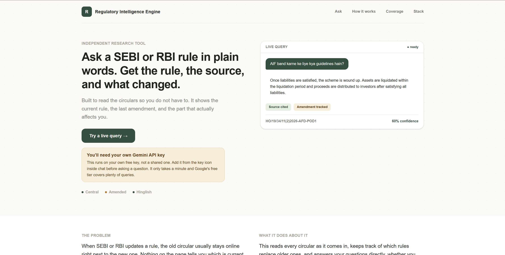
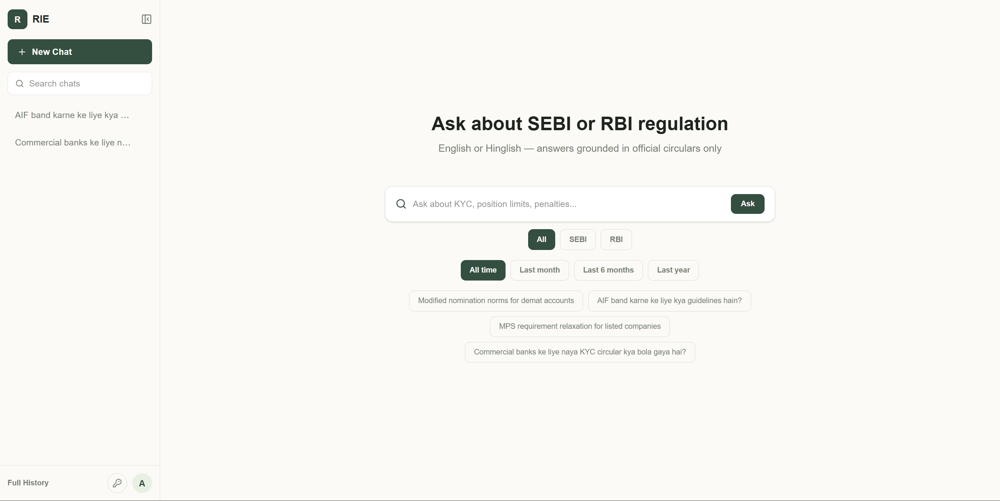
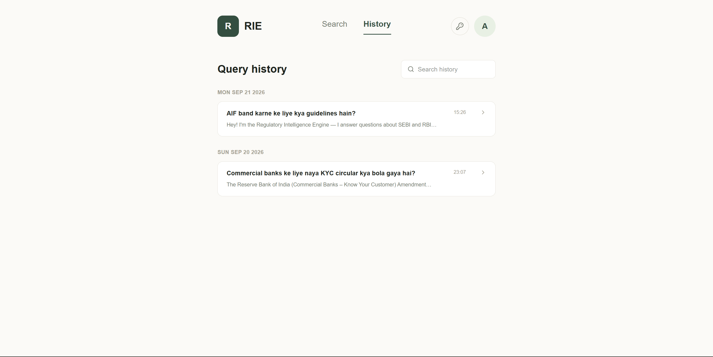
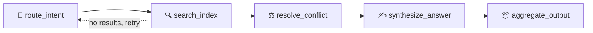

<div align="center">

# 🏛️ Regulatory Intelligence Engine

**Ask SEBI or RBI a question in plain English (or Hinglish). Get the rule, the source, and what changed — not just a wall of PDF text.**

[](#)


</div>

---

## What is this?

SEBI and RBI publish new circulars constantly — dense, layout-heavy PDFs, spread across separate websites, with old and new versions of the same rule often sitting online side by side and no clear label on which one is current. Get the wrong version and it's not a typo, it's a compliance problem.

This project reads those circulars, keeps track of which rules replace older ones, and lets you just *ask* — in English or Hinglish — instead of hunting through PDFs. Every answer comes with its source, a confidence score, and a full trace of how the system got there.

## 📸 See it in action

| Landing page | Ask a question | Full history |
|:---:|:---:|:---:|
|  |  |  |

## 🧠 How it thinks

Every question runs through a 5-step LangGraph agent — not a single black-box LLM call:



| Step | What it actually does |
|---|---|
| **route_intent** | Turns your casual Hinglish/English question into a clean search query, using your last few messages for context if you're following up on something |
| **search_index** | Searches the vector index — separately for SEBI vs. RBI if you're comparing the two |
| **resolve_conflict** | If a rule was amended, pulls *both* the old and new version and labels them clearly — never mixes them together |
| **synthesize_answer** | Writes the answer using only what was actually retrieved. If nothing relevant was found, it says so — it never makes something up |
| **aggregate_output** | Bundles the answer, citations, and full execution log for the frontend to display |

Every one of those steps is visible in the app itself — click "How this was generated" on any answer to see the real trace.

## ✨ Features

- 🗣️ **Ask in Hinglish or English** — "AIF band karne ke liye kya guidelines hain?" works exactly like the formal version
- ⚖️ **Amendment-aware** — old and current versions of a rule are shown side by side, never blended into one confusing answer
- 🔍 **Full transparency** — see exactly which node ran, what it retrieved, and why, for every single answer
- 📎 **Cited, scored answers** — every response links back to its source circular with a confidence score
- 🔑 **Bring your own key** — runs on your own free Gemini API key, no shared quota to fight over
- 🛡️ **No hallucinated answers** — if it's not in the retrieved circulars, the system tells you it doesn't know, instead of guessing

## 🛠️ Built with

| Layer | Tech |
|---|---|
| Backend | FastAPI (async), LangGraph, LangChain |
| LLM | Google Gemini in production, with a local-first fallback via **Ollama** for offline/no-cost development |
| Vector search | FAISS |
| Database | PostgreSQL, hosted free on [Neon](https://neon.tech) — stores chat threads, LangGraph's conversation checkpoints, and an ingestion dedupe table so the same circular is never processed twice |
| Frontend | React + Tailwind CSS |
| Observability | LangSmith |
| PDF ingestion | PyMuPDF + Tesseract OCR (for scanned circulars) |
| Containerization | Docker (backend) |

## 🚀 Getting started

Want to run it yourself? Here's the whole thing, start to finish.

### 1. Clone it

```bash
git clone https://github.com/Sanjay-jat/regulatory-intelligence-engine.git
cd regulatory-intelligence-engine
```

### 2. Get a free Gemini API key

Grab one in a minute at [aistudio.google.com/apikey](https://aistudio.google.com/apikey) — you'll need it either way.

### 3. Spin up the backend

```bash
cd rie-backend
pip install -r requirements.txt
cp .env.example .env
```

Open `.env` and fill in:

| Variable | What it's for |
|---|---|
| `LLM_PROVIDER` | `gemini` (or `ollama` if you want to run a local model instead) |
| `GEMINI_API_KEY` | Your key from step 2 |
| `DATABASE_URL` | A PostgreSQL connection string ([neon.tech](https://neon.tech) has a free tier that works great) |
| `FAISS_INDEX_PATH` | Leave as default — a small sample index ships with the repo |
| `API_KEY` | Any string you choose — this locks down your own API |
| `RATE_LIMIT_PER_MINUTE` | Requests allowed per IP per minute |

Then run it:

```bash
uvicorn app.main:app --reload
```

Backend's up at `http://localhost:8000`.

### 4. Spin up the frontend

```bash
cd ../rie-frontend
npm install
cp .env.example .env
```

Set `VITE_API_URL` to your backend URL and `VITE_API_KEY` to match the `API_KEY` you picked above. Then:

```bash
npm run dev
```

Open the URL it gives you, add your Gemini key from the 🔑 icon in the app, and start asking questions.

## 📚 What's in the index right now

Around 45 circulars from SEBI and RBI, mostly from the recent period — enough to see amendment tracking, citations, and Hinglish queries working end to end. It's a working demo, not the full regulatory archive (yet).

## 🤔 Things worth knowing

- **Your API key is visible in the browser bundle.** This is a static single-page app — any `VITE_`-prefixed variable ships in the public JS by design. Rate limiting keeps the backend safe from abuse, but this isn't a secret-storage mechanism.
- **No shared key in production** — everyone brings their own Gemini key. There's no fallback quota to burn through.
- **Gemini's free tier has daily limits**, which can pause bulk ingestion runs mid-way. Nothing breaks — it just picks up where it left off.

## 🔗 Connect

Built by **Sanjay** — [github.com/Sanjay-jat](https://github.com/Sanjay-jat)

If you spot a bug or have an idea, open an issue. Always happy to hear from people who've actually poked around in the code.
